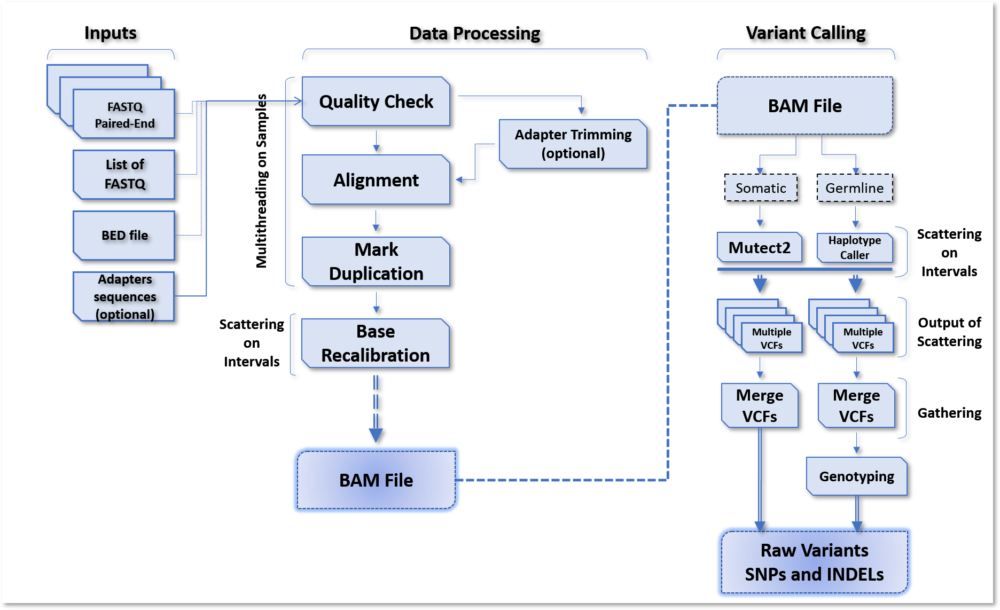

## Whole Exome Sequencing Pipeline - Somatic Analysis
#### Using Scatter-Gather option provided by the Broad Institute for faster runs

This repository contains an implementation of the Whole Exome Sequencing (WES) pipeline based on GATK best practices workflows using WDL scripts (Workflow Description Language).

1) The pipeline is optimized to run samples in parallel
2) The Docker version allow users to chose the number of samples to run in parallel based on available resources (threads and memory; available upon request)
3) WDL and JSON made easy by removing "excessive statements"
4) Single line command to run the whole pipeline (QC, trimming, mapping, markduplicates, base recalibration, variant calling and annotation)

The diagram below summarizes the germline and somatic analysis (on tumor only or on tumor/normal pairs if available).

The pipelines consist of WDL scripts that run the analysis in addition to shell scripts that act as intermediate steps. The pipelines were tested successfully based on the following dependencies: 

    Java 8 
    Cromwell v36 
    FastQC v0.11.5 
    BWA 0.7.17-r1194-dirty 
    Cutadapt 1.18 
    Samtools 1.8 – should be in the PATH 
    GATK-4.0.11.0 
    Tabix 0.2.5 

Also, you should download the human reference genome and create its index using BWA. In addition, some databases used for base recalibration should be downloaded too: 

    dbsnp
    phase1snps 
    Mills_and_1000G_gold_standard 
    HapMap 
    Omni 
    Axiom 

You can download the reference genome and its index, the intervals and the databases listed above from resources directory provided by Broad Institute from the following link: 

https://console.cloud.google.com/storage/browser/genomics-public-data/resources/broad/hg38/v0/?pli=1

Each one of the WDL and shell scripts can be invoked independently by providing the project directory as argument.
  
the `projectDir` should have the following structure:  

1- A directory named "fastq" which contains FASTQ files. FASTQ files should have the following naming style:
    sampleName_R1.fastq.gz and sampleName_R2.fastq.gz

2- A directory named "lists" containing three files:

&ensp;&ensp;&ensp;&ensp;**1) fastq_list.txt:** A tab separated file listing samples in the following format:

            sampleName1    sampleName1_R1.fastq.gz    sampleName1_R2.fastq.gz
            sampleName2    sampleName2_R1.fastq.gz    sampleName2_R2.fastq.gz

In the case of somatic analysis with tumor/normal samples, samples should be named
in the following format *where 'T' refers to 'Tumor' and 'N' refers to 'Normal'*
(the order of samples in this file does not matter):

	        sampleName1-T	sampleName1-T_R1.fastq.gz	sampleName1-T_R2.fastq.gz
            sampleName1-N	sampleName1-N_R1.fastq.gz	sampleName1-N_R2.fastq.gz
            sampleName2-T	sampleName2-T_R1.fastq.gz	sampleName2-T_R2.fastq.gz
            sampleName2-N	sampleName2-N_R1.fastq.gz	sampleName2-N_R2.fastq.gz

&ensp;&ensp;&ensp;&ensp;**2) intervals.txt** Contains a list of full path of all intervals in BED format:

            path/to/intervals/scattered_calling_intervals/temp_0001_of_50/scattered.interval_list
			path/to/intervals/scattered_calling_intervals/temp_0002_of_50/scattered.interval_list
			path/to/intervals/scattered_calling_intervals/temp_0003_of_50/scattered.interval_list
			path/to/intervals/scattered_calling_intervals/temp_0004_of_50/scattered.interval_list
			path/to/intervals/scattered_calling_intervals/temp_0005_of_50/scattered.interval_list

&ensp;&ensp;&ensp;&ensp;**3) adapters.txt** Contains adapters to be trimmed: 

	        The first line should contain first read adapter (forward) and the second
            line should contain second read adapter (reverse) 

To run the pipeline, you must specify full paths for each tool and database in the JSON file. Once done, you can invoke the pipeline using the following command:  

`/path/to/run.sh /path/to/project/directory /path/to/cromwell.jar`

To use the Docker image (available upon request), you must prepare the ‘project directory’ as mentioned above and invoke the Docker image using the following command:  

`docker run -it -v /path/to/project/directory/:/data/ pklab/wes_pipelines `

*You can invoke each WDL and shell scripts separately.*  
*If you use the Docker, all you need is to use "fastq_list.txt", "intervals.txt" and "adapters.txt" in the "lists" directory.*

